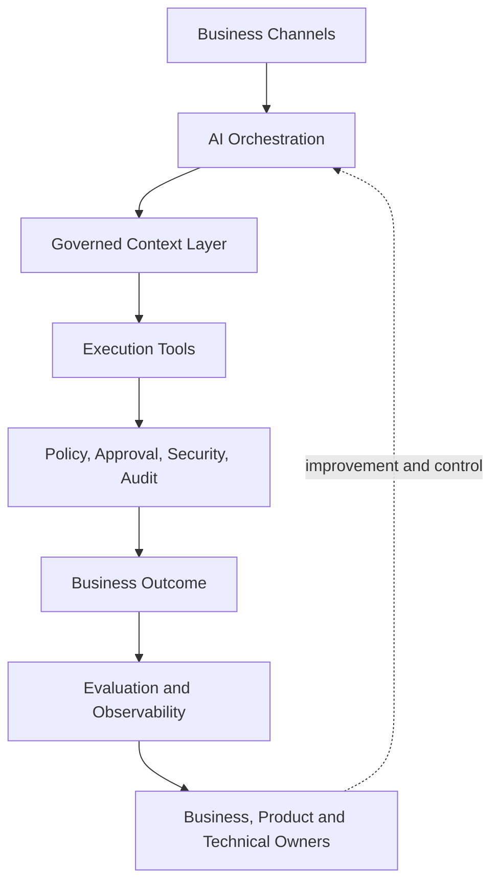

# AI Engineering Maturity Roadmap

The roadmap develops AI capability and responsibility together. It starts with effective use,
progresses through controlled action and measurable systems, and ends with accountable enterprise
product ownership.

```text
AI User
   ↓
Prompt Engineer
   ↓
AI Automation Engineer
   ↓
AI Engineer
   ↓
AI Solution Architect
   ↓
AI Product / Solution Owner
```

The four capability levels map to four observable outcomes:

```text
USE AI       → BUILD WITH AI → ENGINEER AI → OWN AI
ANSWER       → ACTION        → SYSTEM      → PRODUCT
```

## How to use this roadmap

Progress is evidence-based. A learner may test out of familiar material by demonstrating the exit
criteria, but should not skip evaluation, security, or production ownership because a demo appears
to work.

Every level specifies:

- required knowledge and engineering skills;
- tools and system boundaries;
- expected deliverables;
- production and security responsibility;
- recommended hands-on evidence.

## Level 1 — Use AI: Prompt & Context Engineering

**Core question:** How do I get better, repeatable answers?

**Boundary:** AI produces information. A human still decides and performs the business action.

### Required knowledge

- AI and LLM capabilities, probabilistic behavior, context windows, and material limitations.
- The difference between prompt engineering (what the model should do) and context engineering
  (what the model needs to know).
- A practical prompt checklist: role, goal, context, task/input, constraints, output, and examples.
- Structured outputs, few-shot examples, system instructions, verification, and prompt versioning.
- Context quality: relevance, authority, freshness, sufficiency, and authorization.
- RAG as controlled runtime retrieval rather than indiscriminate document loading.

### Required engineering skills

- Convert vague requests into explicit, testable task contracts.
- Select the minimum necessary context from governed sources.
- Define output schemas and reject malformed or incomplete results.
- Create representative test cases and inspect failure categories.
- Version prompts and context assumptions so behavior can be reproduced.

### Required tools

An approved model interface, a text or code editor, Git, JSON validation, and safe sample documents.
Retrieval may be introduced to explain context sourcing, but autonomous business execution is out of
scope at this level.

### Expected deliverables

- A reusable prompt pattern with purpose, owner, version, inputs, constraints, and output contract.
- A small test set covering normal, edge, missing-context, and unsafe-input cases.
- A context-source register identifying source authority, freshness, permissions, and retention.
- A result review documenting errors, limitations, and the next improvement hypothesis.

### Production responsibility

The learner owns correct task framing and human verification before use. Level 1 output must not be
presented as an authorized business decision or automatically mutate enterprise state.

### Security responsibility

Exclude unnecessary personal data, passwords, API keys, confidential documents, unauthorized
content, and outdated procedures. Document what the model may and may not receive.

### Recommended labs

Use the [Level 1 lab contract](labs/level-1/README.md): basic prompting, role and context, structured
output, context engineering, and prompt debugging.

### Exit criteria

The learner can turn a weak request into a structured, reusable, testable AI task; justify its
context; validate the result against explicit criteria; and explain why a human remains responsible
for the action.

## Level 2 — Build with AI: Tools & Automation

**Core question:** How can AI perform useful work without receiving uncontrolled authority?

**Boundary:** AI may select or propose a capability. The application controls authorization,
validation, execution, and durable state.

### Required knowledge

- Tool and function contracts, REST APIs, databases, files, search, and structured errors.
- Read versus write capabilities and risk-based autonomy.
- Workflow engines, RPA, queues, idempotency, retries, reconciliation, and human approval.
- MCP as a standardized integration mechanism—not an authorization boundary.
- Deterministic workflow versus agentic workflow trade-offs.
- RAG, model, tool, policy, system-of-record, and audit responsibilities.

### Required engineering skills

- Expose narrow, testable capabilities with typed inputs and outputs.
- Validate identity, permission, schema, business rules, and risk before execution.
- Separate reasoning, policy, execution, system of record, reconciliation, and audit.
- Design safe failure behavior and prevent duplicate or partially committed actions.
- Integrate APIs, SQL, files, workflow tools, or RPA without giving the model broad access.

### Required tools

Python or JavaScript, REST/JSON, SQL, model tool calling, MCP where appropriate, and an orchestration
or automation platform such as n8n or UiPath. Enterprise examples may include Azure services, but
the architecture must remain portable.

### Expected deliverables

- Tool contracts with input/output schemas, owner, permissions, timeout, and error behavior.
- A workflow diagram showing model, policy gate, tools, business system, and audit path.
- A risk classification for every tool, including required approval and autonomy level.
- Integration tests for valid, invalid, unauthorized, unavailable, and duplicate requests.
- A controlled execution record with correlation ID and reconciliation result.

### Production responsibility

The learner owns integration behavior, deterministic controls, partial-failure handling, and the
ability to reconcile the system of record. A model recommendation is never itself proof that an
action is allowed.

### Security responsibility

Use authenticated identities, least privilege, narrow tool scopes, input validation, output
sanitization, rate limits, approved endpoints, and audit records. Material actions such as payment,
deletion, external communication, or access change require stronger controls and often human review.

### Recommended labs

Use the [Level 2 lab contract](labs/level-2/README.md): API calls, function calling, MCP, database
access, n8n orchestration, and UiPath integration.

### Exit criteria

The learner can design and demonstrate a workflow that safely moves from information to action,
with explicit contracts, risk-based authorization, bounded permissions, deterministic execution,
and a traceable outcome.

## Level 3 — Engineer AI: Evaluation, Reliability & Scale

**Core question:** How do we prove the system is good enough—and that it stays good enough?

**Boundary:** A successful demo proves possibility. Level 3 evidence must prove repeatable quality,
reliability, operability, and acceptable economics.

### Required knowledge

- Business requirements, acceptance criteria, test cases, evaluation metrics, and production KPIs.
- Golden datasets covering normal, edge, known-failure, high-risk, and adversarial cases.
- Accuracy, grounding, task success, tool-use correctness, precision, recall, F1, and calibration
  where the decision context makes them useful.
- Offline evaluation, online monitoring, regression testing, and cautious A/B testing.
- Observability across input, context, model, tool calls, response, and business outcome.
- Reliability patterns, latency/throughput, cost per successful transaction, capacity, and scale.

### Required engineering skills

- Define “good” before testing and connect requirements to metrics and release thresholds.
- Build reproducible evaluation datasets and automated regression gates.
- Version prompts, models, context, retrieval, tools, policies, and data assumptions.
- Trace failures end to end without collecting unnecessary sensitive content.
- Distinguish transient technical failures from validation or consequential failures.
- Design bounded retry, fallback, escalation, rollback, and graceful degradation.

### Required tools

Test and evaluation frameworks, dataset/version controls, tracing, logs, metrics, dashboards, load
testing, CI release gates, and cost telemetry. Tools are selected for evidence quality rather than
dashboard appearance.

### Expected deliverables

- Measurable acceptance criteria and a versioned representative evaluation dataset.
- Baseline and candidate results across quality, safety, reliability, latency, cost, and business KPIs.
- A regression gate that rejects changes violating declared thresholds.
- An observability map with correlation IDs, safe telemetry, alerts, and investigation queries.
- A failure-mode analysis, capacity estimate, rollback plan, runbook, and escalation path.

### Production responsibility

The learner owns release evidence and the ability to identify, contain, and recover from a
regression. Infrastructure uptime is insufficient when task quality or business outcomes silently
degrade.

### Security responsibility

Include adversarial and authorization cases in evaluation. Do not log credentials, tokens, secrets,
or sensitive content without a documented business and security need. Security testing complements;
it is not replaced by AI evaluation.

### Recommended labs

Use the [Level 3 lab contract](labs/level-3/README.md): evaluation, golden datasets, regression tests,
observability, and cost/performance analysis.

### Exit criteria

The learner can show that a candidate system meets traceable release thresholds, survives realistic
failures, remains observable under load, and can be rejected, degraded, or rolled back safely.

## Level 4 — Own AI: Governance & Responsibility

**Core question:** Should AI be allowed to do this, who owns the outcome, and can we explain what happened?

**Boundary:** Reliable is not automatically responsible. Named people remain accountable for the
production capability and its effects.

### Required knowledge

- Governance, responsible AI, risk classification, data privacy, and lifecycle controls.
- Authentication, authorization, RBAC, least privilege, prompt injection, and data leakage.
- Guardrails, policy engines, deterministic authorization, human approval, and kill switches.
- Auditability, model/tool version control, incident management, and change control.
- Product ownership, measurable value, user impact, vendor dependency, and retirement decisions.
- The S.A.F.E.R. ownership lens: Security, Accountability, Fairness & Safety, Evaluation, Responsibility.

### Required engineering skills

- Classify actions by consequence and decrease autonomy as risk increases.
- Assign business, product, technical, security, and operational ownership.
- Design approval, exception, audit, incident, recovery, and decommissioning processes.
- Test prompt injection, privilege escalation, data exposure, unsafe tool use, and control bypass.
- Connect governance policy to runtime enforcement, monitoring, and evidence.
- Review quality, risk, cost, and business outcomes throughout the product lifecycle.

### Required tools

Identity and access management, secret management, policy enforcement, audit logging, security
testing, data classification, monitoring, incident tracking, model/tool registries, and change
management systems.

### Expected deliverables

- An AI use-case charter with named owners, intended outcomes, and prohibited uses.
- A risk assessment and control matrix tied to runtime enforcement.
- A human-approval design for consequential actions and defined emergency stop behavior.
- An audit model covering decisions, context sources, versions, tool calls, approvals, and outcomes.
- A production-readiness checklist, runbook, incident report process, and review cadence.
- A benefits, cost, limitations, and retirement plan owned by the product or solution owner.

### Production responsibility

The owner is accountable for quality, risk, value, support, changes, incidents, and retirement. The
system must be safe to operate, explain, correct, and improve—not merely capable of producing an
answer.

### Security responsibility

Apply defense in depth and deterministic authorization for consequential actions. High-risk changes
require explicit human or policy approval, full auditability, and tested containment. Connectivity
never implies authorization.

### Recommended labs

Use the [Level 4 lab contract](labs/level-4/README.md): AI security, prompt injection, human approval,
audit logging, and production-readiness review.

### Exit criteria

The learner can present a governed enterprise AI product with named accountability, risk-based
controls, verifiable approval and audit paths, incident readiness, measurable outcomes, and a clear
decision about when the system should not act.

## Enterprise capability blueprint



Design responsibilities remain separated:

- the model reasons over an explicit task and context;
- policy determines whether a proposed action is allowed;
- tools execute narrow defined capabilities;
- the enterprise system of record remains business truth;
- reconciliation confirms durable outcome;
- evaluation and observability measure behavior;
- named owners accept accountability.

## Cross-level skills matrix

Stars indicate relative emphasis, not whether a capability may be ignored.

| Capability | L1 Use | L2 Build | L3 Engineer | L4 Own |
| --- | :---: | :---: | :---: | :---: |
| Prompt engineering | ★★★ | ★★★ | ★★★ | ★★★ |
| Context engineering | ★★★ | ★★★ | ★★★ | ★★★ |
| APIs, RAG, MCP, and automation | ★ | ★★★ | ★★★ | ★★ |
| Evaluation and observability | ★ | ★ | ★★★ | ★★★ |
| Reliability and scale | — | ★ | ★★★ | ★★★ |
| Security and governance | ★ | ★★ | ★★★ | ★★★ |
| Product ownership | — | ★ | ★★ | ★★★ |

## Suggested eight-week learning plan

| Week | Focus | Mini-project milestone |
| --- | --- | --- |
| 1 | AI and LLM fundamentals | Define capability, limitations, and business use case. |
| 2 | Prompt engineering | Build a structured, versioned AI assistant. |
| 3 | Context engineering and RAG | Add governed context with quality and permission checks. |
| 4 | APIs, tools, and function calling | Expose and test narrow read and write capabilities. |
| 5 | Automation, agents, and MCP | Build a tool-using workflow with policy and approval boundaries. |
| 6 | Evaluation, testing, and observability | Add a golden dataset, regression gate, and end-to-end trace. |
| 7 | Production architecture, security, and scale | Demonstrate failure handling and production readiness. |
| 8 | Governance, risk, and AI product ownership | Present an accountable, governed enterprise AI product. |

## Project gates

| Gate | Required evidence | Principal review question |
| --- | --- | --- |
| Level 1 assistant | Prompt contract, governed context, structured output, test cases | Is the answer repeatable, appropriately grounded, and safe for human use? |
| Level 2 workflow | Tool contracts, policy gate, integration tests, audit path | Can it act without receiving excessive authority? |
| Level 3 system | Evaluation data, thresholds, telemetry, failure and cost analysis | Can we prove it works and detect when it stops working? |
| Level 4 product | Owners, risk controls, approvals, incident process, business KPIs | Should it operate, and who is accountable for each outcome? |

## Repository delivery phases

Repository delivery is separate from learner maturity. Phase 1 is complete, and the Level 1 subset
of Phase 7 is implemented as a five-lab OpenAI Chat Playground sequence.

| Phase | Repository scope | Status |
| --- | --- | --- |
| 1 | Structure, root documentation, contribution policy, secret-safe configuration, and domain contracts | **Complete** |
| 2 | `docs/01_Prompt_Context_Engineering/` lessons and examples | **Planned** |
| 3 | `docs/02_AI_Tools_Automation/` lessons and examples | **Planned** |
| 4 | `docs/03_Evaluation_Reliability_Scale/` lessons and examples | **Planned** |
| 5 | `docs/04_Ownership_Responsibility/` lessons and examples | **Planned** |
| 6 | Agentic AI, enterprise architectures, security guidance, and reusable templates | **Planned** |
| 7 | Executable labs for all four maturity levels | **In progress — Level 1 complete; Levels 2–4 planned** |

## Maintenance policy

- Teach durable responsibilities before provider-specific procedures.
- Use primary documentation and record versions or review dates for time-sensitive claims.
- Treat prompts, context, retrieval, models, tools, policies, and datasets as release artifacts.
- Check relative links, Mermaid blocks, code examples, and secret patterns with every change.
- Record migrations when a tool or model change invalidates a documented workflow.
- Preserve the distinction between prototype guidance and production requirements.

The root [README](README.md) defines repository navigation and the evidence standard.
