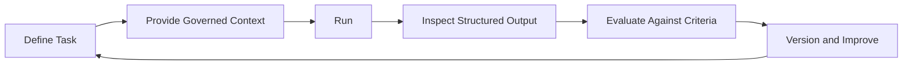

# Level 1 — Prompt & Context Engineering

Level 1 teaches people to produce better, safer, repeatable answers. The model informs; a human
still verifies, decides, and performs the business action.

## Core model

```text
ROLE
+ GOAL
+ CONTEXT
+ TASK / INPUT
+ CONSTRAINTS
+ OUTPUT FORMAT
+ EXAMPLES
= BETTER, TESTABLE AI RESULT
```

This is a design checklist, not a magical formula. The important result is a clear task, the minimum
authorized context, explicit boundaries, a usable output contract, and a way to verify quality.

## Curriculum contract

Future Level 1 content will cover:

- AI fundamentals and material limitations;
- prompt engineering, system instructions, few-shot examples, and reusable patterns;
- prompt versus context engineering;
- governed context sources, context windows, and minimum necessary context;
- structured JSON output and schema validation;
- prompt debugging, evaluation loops, versioning, and common failures;
- role-specific examples for analysts, project managers, developers, architects, RPA engineers,
  and AI engineers.

## Context quality gate

Before supplying information to a model, verify:

1. **Relevance:** Is it needed for the task?
2. **Authority:** Is it an approved source of truth?
3. **Freshness:** Is it current enough for the decision?
4. **Permission:** May this user or workload access it?
5. **Sufficiency:** Is it enough to complete or safely decline the task?

More context is not automatically better context. Retrieve only what the task requires and the
requester is authorized to use.

## Engineering loop



## Enterprise boundary

Level 1 artifacts may summarize, classify, extract, research, support decisions, review code, or
draft documents. They must not silently send messages, alter records, approve payments, grant
access, or take other business actions.

## Security baseline

- Exclude passwords, API keys, unnecessary personal data, and unauthorized confidential content.
- Identify data retention and provider-processing constraints before use.
- Treat retrieved text and user input as untrusted content, not executable authority.
- Validate structured output before presenting or storing it.
- Record limitations and require human review appropriate to the use case.

## Completion evidence

- A versioned prompt contract with role, goal, context, task, constraints, output, and examples.
- A governed context register and missing-context behavior.
- Validated structured output.
- Test cases covering normal, edge, unsafe, and insufficient-context scenarios.
- An error analysis showing at least one measured improvement over a simple baseline.

Practice: [Level 1 labs](../../labs/level-1/README.md) ·
Next: [Level 2 — Tools & Automation](../02_AI_Tools_Automation/README.md) ·
[Knowledge areas](../README.md)
