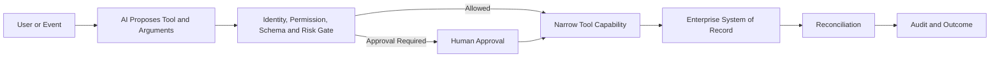

# Level 2 — AI Tools & Automation

Level 2 moves from answers to actions. AI can select or propose a defined capability, but enterprise
architecture determines identity, authorization, validation, execution, reconciliation, and audit.

## Core principle

```text
AI reasons or recommends.
Policy determines what is allowed.
Tools execute narrow capabilities.
Systems of record preserve business truth.
```

## Curriculum contract

Future Level 2 content will cover:

- tool and function calling with typed contracts;
- REST APIs, authentication, errors, timeouts, retries, and idempotency;
- SQL databases, files, search, RAG, and document processing;
- MCP tools, resources, and prompts—plus its security boundaries;
- workflow automation with n8n and RPA integration with UiPath;
- Azure AI and enterprise-application integration;
- read versus write risk classification, policy gates, approval, reconciliation, and audit.

## Reference workflow



## Risk-based autonomy

| Capability | Typical risk | Default control |
| --- | --- | --- |
| Search or retrieve approved information | Low | Automated with monitoring and access control |
| Calculate or validate | Low–medium | Automated with schema and business-rule validation |
| Draft an internal change | Medium | Policy-controlled and reviewable |
| Send externally or update material data | High | Explicit authorization and usually human approval |
| Pay, delete, approve, or grant access | Critical | Deterministic authorization, human control, full audit |

Autonomy should decrease as consequence increases.

## Architecture boundary

Do not create one broadly privileged agent. Prefer a tool gateway exposing narrow, separately
auditable capabilities. Durable state, business authorization, and reconciliation must sit outside
probabilistic model reasoning.

## Security baseline

- Connectivity is not authorization, including when MCP is used.
- Authenticate the workload and authorize every capability independently.
- Validate inputs, sanitize outputs, bound tool scope, set rate limits, and enforce timeouts.
- Prevent duplicate execution and define partial-commit recovery.
- Keep tool results and errors free of secrets or unnecessary sensitive data.

## Completion evidence

- Typed tool contracts with owners, scopes, error behavior, and risk classification.
- A working orchestration path with deterministic policy and approval decisions.
- Integration tests for valid, invalid, unauthorized, unavailable, and duplicate calls.
- Correlated audit and reconciliation evidence linking request to business outcome.
- An explanation of why a deterministic workflow or agentic workflow was selected.

Practice: [Level 2 labs](../../labs/level-2/README.md) ·
Next: [Level 3 — Evaluation, Reliability & Scale](../03_Evaluation_Reliability_Scale/README.md) ·
[Knowledge areas](../README.md)
