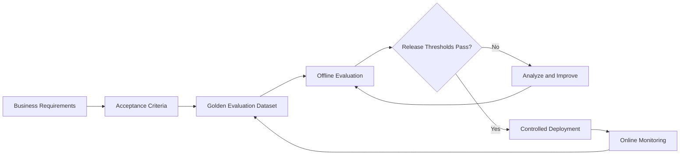

# Level 3 — Evaluation, Reliability & Scale

Level 3 turns a working AI capability into a measurable, testable, supportable production system.
A successful demonstration proves possibility; it does not prove readiness.

## Evaluation lifecycle

## Curriculum contract

Future Level 3 content will cover:

- evaluation requirements, golden datasets, and representative test cases;
- task success, accuracy, grounding, tool correctness, precision, recall, F1, and thresholding;
- hallucination and unsupported-claim measurement;
- regression testing, controlled comparisons, and cautious A/B testing;
- offline evaluation before release and online evaluation after release;
- logs, metrics, traces, correlation IDs, alerting, and failure categorization;
- reliability, latency, throughput, token usage, cost per successful task, and scalability.

## Quality dimensions

| Dimension | Example question |
| --- | --- |
| Task quality | Did the complete user task succeed? |
| Accuracy | Were required facts or classifications correct? |
| Grounding | Is the response supported by approved evidence? |
| Tool use | Was the correct tool called with valid arguments? |
| Safety | Were policies and authorization boundaries respected? |
| Reliability | Did the workflow complete correctly end to end? |
| Performance | Are latency and throughput within service objectives? |
| Cost | What is the cost per successful business transaction? |
| Human impact | How often are escalation, override, or correction required? |
| Business outcome | Did the workflow improve the target operational KPI? |

Optimizing one metric in isolation can harm another. Release gates must cover the dimensions that
matter to the use case.

## Evaluation-dataset contract

A golden dataset should include normal cases, boundary and unusual cases, known failures,
high-impact business cases, and adversarial or safety cases. Each record should identify inputs,
expected behavior, acceptable variation, evidence, expected tool calls, risk, and escalation path as
applicable.

## Reliability boundary

Failures occur across the full chain: gateway, application, retrieval, model, tool, and business
system. Retry only transient failures and keep retries bounded. Validation or consequential failures
should stop, fall back, escalate, or request human review instead of blindly repeating.

## Security baseline

- Include prompt injection, unauthorized tools, unsafe output, and data exposure in evaluation.
- Log versions, identifiers, decisions, and status without logging secrets or unnecessary content.
- Use production telemetry only under approved data retention and access rules.
- Require security testing in addition to AI evaluation and traditional software testing.

## Completion evidence

- Traceable requirements, acceptance criteria, metrics, test cases, and production KPIs.
- A versioned golden dataset and reproducible baseline.
- A regression gate covering quality, safety, reliability, latency, and cost thresholds.
- End-to-end observability from request through business outcome.
- Failure, capacity, cost, fallback, rollback, runbook, and escalation evidence.

Practice: [Level 3 labs](../../labs/level-3/README.md) ·
Next: [Level 4 — Ownership & Responsibility](../04_Ownership_Responsibility/README.md) ·
[Knowledge areas](../README.md)
