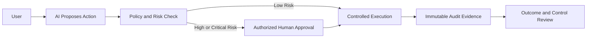

# Level 4 — Ownership & Responsibility

Level 4 changes the question from “Can AI do this?” to “Should AI be allowed to do this, under whose
authority, and with what accountability?” Reliable behavior is necessary but not sufficient.

## Governing principle

```text
AI may recommend.
Deterministic controls validate and authorize.
Humans approve consequential actions.
Systems maintain an audit trail.
Named owners remain accountable for outcomes.
```

## Curriculum contract

Future Level 4 content will cover:

- AI governance, responsible AI, product ownership, and lifecycle management;
- security architecture, privacy, data classification, and retention;
- prompt injection, data leakage, tool authorization, RBAC, and least privilege;
- risk classification, guardrails, policy enforcement, and human approval;
- audit trails, model/tool version management, change control, and kill switches;
- monitoring, AI incident management, operational review, and retirement decisions.

## Risk and control model

| Risk | Example actions | Expected control |
| --- | --- | --- |
| Low | Summarize, search, recommend, draft | Automated with access control and standard monitoring |
| Medium | Classify, route, update low-impact internal data | Policy checks, bounded permission, validation, fallback |
| High | External communication, material data change | Deterministic authorization, human approval, full audit |
| Critical | Payment, deletion, access grant, formal approval | Human control, segregation of duties, kill switch, incident readiness |

Risk must be assessed using consequence, reversibility, affected users, data sensitivity, legal or
regulatory exposure, and the model's actual authority—not only the apparent complexity of the task.

## S.A.F.E.R. ownership lens

- **Security:** identity, authorization, secrets, least privilege, and containment.
- **Accountability:** named business, product, technical, security, and operational owners.
- **Fairness & Safety:** impact analysis, misuse controls, harmful-output controls, and guardrails.
- **Evaluation:** continuous measurement of quality, risk, reliability, cost, and value.
- **Responsibility:** humans remain accountable for production outcomes and lifecycle decisions.

## Human-in-the-loop pattern



Approval must be informed, attributable, timely, and performed by someone with real authority. A
rubber-stamp interface is not an effective control.

## Security baseline

- Enforce authorization outside model reasoning.
- Test prompt injection, privilege escalation, unsafe tool selection, and control bypass.
- Protect secrets with approved secret management and short-lived identities where possible.
- Define incident severity, containment, recovery, notification, and evidence preservation.
- Maintain version and change records for every component affecting behavior.

## Completion evidence

- A named ownership model and AI project charter.
- Risk assessment mapped to enforceable preventive, detective, and corrective controls.
- Human-approval, audit, kill-switch, and incident-management designs.
- Production readiness and periodic review criteria.
- Measurable business outcomes, limitations, cost, and a decommissioning trigger.

Practice: [Level 4 labs](../../labs/level-4/README.md) ·
Next: [Agentic AI](../05_Agentic_AI/README.md) · [Knowledge areas](../README.md)
