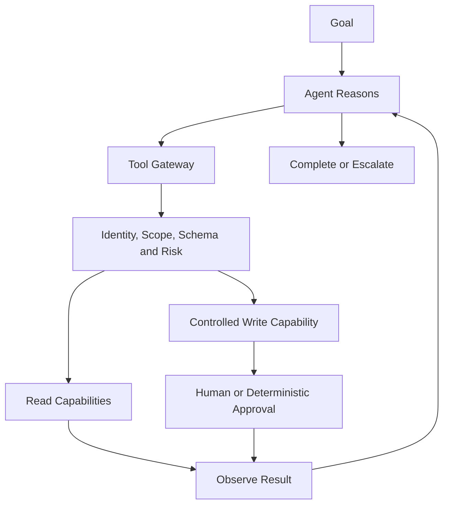

# Agentic AI

Agentic AI adds adaptive tool selection and iterative control flow to a model-backed application. It
is useful only when that flexibility improves a measured task enough to justify added latency, cost,
failure modes, and authority risk.

## Agent model

```text
Agent =
Model
+ Instructions
+ Context
+ Tools
+ State / Memory
+ Guardrails
+ Evaluation
+ Observability
```

Memory is an explicit data design with purpose, permissions, retention, and deletion—not unlimited
conversation history.

## Deterministic versus agentic workflow

| Deterministic workflow | Agentic workflow |
| --- | --- |
| Input → rule → process → output | Goal → reason → select tool → execute → observe → adjust → complete |
| Predictable steps and bounded paths | Dynamic steps chosen from bounded capabilities |
| Easier to test, audit, and cost | Handles ambiguity and changing intermediate results |
| Prefer for stable, regulated, or consequential processes | Consider for complex tasks where adaptation is measurably useful |

Use deterministic workflows when the process can be expressed clearly, the action is high impact,
the allowed path is narrow, strict timing is required, or audit simplicity matters more than
flexibility.

## Curriculum contract

Future content will cover agent fundamentals, model/tool/state separation, RAG, MCP, orchestration,
multi-agent coordination, human-in-the-loop design, guardrails, and agent observability.

## Bounded enterprise pattern



Avoid a super-agent with broad ERP, CRM, email, database, payment, or administrative access. Expose
narrow capabilities with individual scopes, contracts, risk controls, and audit records.

## Completion evidence

- A decision explaining why agentic control is preferable to a deterministic workflow.
- A bounded tool inventory, permission model, state lifecycle, and termination conditions.
- Evaluation of task success, tool correctness, loop count, latency, cost, and unsafe behavior.
- Adversarial tests, human escalation, failure containment, and end-to-end traces.
- A comparison showing the agent earns its additional complexity.

Previous: [Level 4 — Ownership & Responsibility](../04_Ownership_Responsibility/README.md) ·
Next: [Enterprise Architecture](../06_Enterprise_Architecture/README.md) ·
[Knowledge areas](../README.md)
