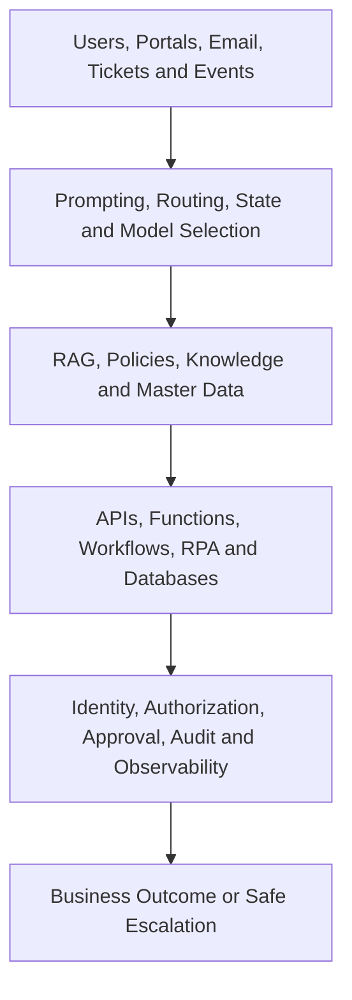

# Enterprise Architecture

This area turns individual AI techniques into architectures with explicit business outcomes, trust
boundaries, failure behavior, security controls, observability, and ownership.

## Architecture patterns

| Pattern | Flow | Typical use |
| --- | --- | --- |
| AI-assisted application | User → AI → API → enterprise application | Search, recommendations, assisted case handling |
| Document intelligence | Document → OCR → AI extraction → validation → rules → ERP | Invoice, form, and correspondence processing |
| Hybrid automation | Application → workflow → AI agent → API/RPA → legacy system | Orchestration across modern and legacy systems |
| Governed enterprise agent | User/event → agent → guardrail/policy → tools → enterprise systems | Bounded multi-tool work |
| Human-approved action | Agent → approval → execute → reconcile → audit | Financial, access, external, or high-impact actions |

Each implemented architecture must explain the problem, use case, components, data flow, trust
boundaries, security controls, failure handling, logging, monitoring, advantages, limitations, and
named ownership.

## Reference layers

The ordering is conceptual, not a claim that controls occur only after execution. Identity,
authorization, input validation, and risk gates must be enforced before material actions; audit,
reconciliation, and outcome monitoring continue afterward.

## Design principles

- Start from the business problem and measurable outcome.
- Keep actions deterministic where the allowed process is known.
- Separate model reasoning from business authority and durable state.
- Give tools the minimum capability required for a single purpose.
- Design for unavailable providers, bad context, unsafe output, partial commits, and human escalation.
- Trace input, context, versions, decisions, tools, approvals, and outcome without unsafe logging.
- Include product, business, technical, security, and operational owners.

## Architecture-review evidence

- Requirements and declared non-goals.
- At least two credible options with trade-offs.
- Data classification, identity, permissions, and trust boundaries.
- Latency, capacity, availability, recovery, and cost assumptions.
- Failure-mode, threat, fallback, reconciliation, and incident analyses.
- Evaluation strategy, production KPIs, observability, and review cadence.
- Decision record showing what evidence would invalidate the chosen design.

Related: [Architecture library](../../architectures/README.md) ·
[Knowledge areas](../README.md) · [Maturity roadmap](../../ROADMAP.md)
